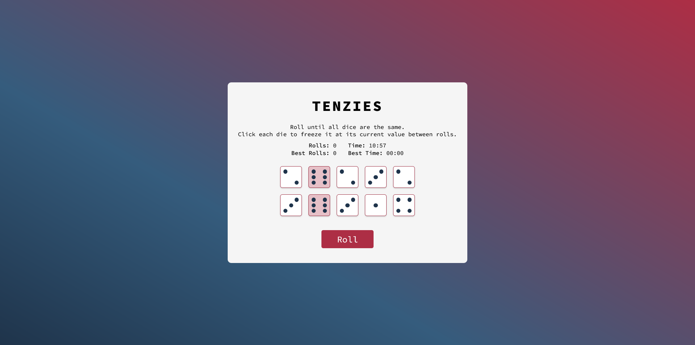

# Tenzies Game

## About
This is a project a part of Scrimba's Front-End Developer Career Path. It represents a dece game known as "Tenzies."

## Table of Contents
- [About](#about)
- [Built with](#built-with)
- [Extra features] (#extra-features)
- [Design](#design)
- [Live Preview](#live-preview)
- [Links](#links)

## Built with
- Semantic HTML5 markup
- CSS custom properties
- Flexbox
- [React](https://reactjs.org/) - JS library

## Design
The app's design is based on the Figma page provided by Scrimba, but with some modifications by myself.

## Extra features
- Realistic dice representation with dots.
- Animation when rolling the dice for improved user experience.
- Track the number of rolls and elapsed time.
- Store best rolls and best time in localStorage for record-keeping.
- Enhanced responsiveness for smaller screen sizes.

## Live preview
### Mobile

### Desktop

## Links
- Live site: (https://tenzies-amy0h.netlify.app/)
- Github repository: (https://github.com/amy0h/tenzies)
